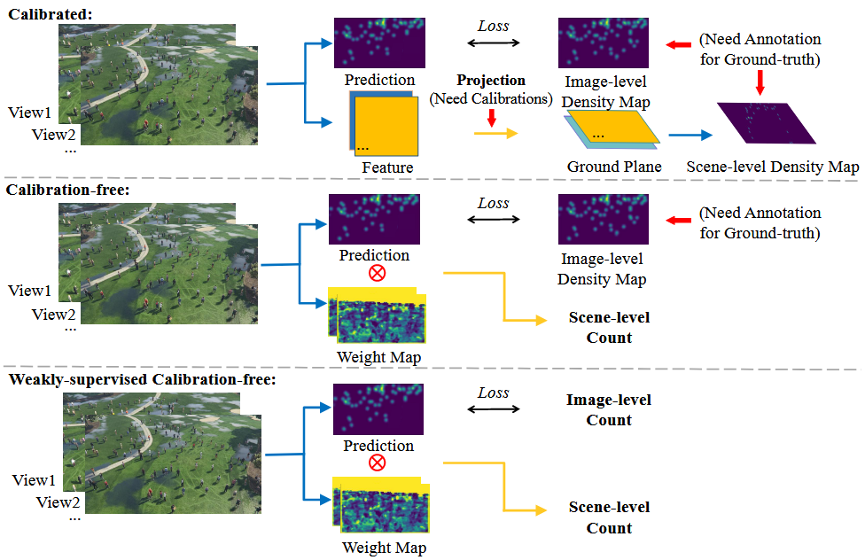

# WSCF-MVCC: Weakly-supervised  Calibration-free Multi-view Crowd Counting. PRCV 2025
## Bin Li, Daijie Chen, and Qi Zhang


## Abstract
Multi-view crowd counting can effectively mitigate occlusion issues that commonly arise in single-image crowd counting. Existing deep-learning multi-view crowd counting methods project different camera view images onto a common space to obtain ground-plane density maps, requiring abundant and costly crowd annotations and camera calibrations. Hence, calibration-free methods are proposed that do not require camera calibrations and scene-level crowd annotations. However, existing calibration-free methods still require expensive image-level crowd annotations for training the single-view counting module. Thus, in this paper, we propose a weakly-supervised calibration-free multi-view crowd counting method (WSCF-MVCC), directly using crowd count as supervision for the single-view counting module rather than density maps constructed from crowd annotations. Instead, a self-supervised ranking loss that leverages multi-scale priors is utilized to enhance the model’s perceptual ability without additional annotation costs. What’s more, the proposed model leverages semantic information to achieve a more accurate view matching and, consequently, a more precise scene-level crowd count estimation. The proposed method outperforms the state-of-the-art methods on three widely used multi-view counting datasets under weakly supervised settings, indicating that it is more suitable for practical deployment compared with calibrated methods.


## Poster 
PRCV 2025 poster:


## Overview
We release the PyTorch code for the WSCF-MVCC, a weakly-supervised calibration-free multi-view crowd counting method (WSCF-MVCC). 

## Dependencies
see requirements.txt or environment.yml

## Data Preparation
datasets are listed in ```/mnt/d/data```, and download links are as follow:
* [CVCS](https://github.com/zqyq/Cross-view-cross-scene-multi-view-counting-CVPR2021)
* [CityStreet](https://drive.google.com/drive/folders/11hK1REG3P35S9ANXk1YB7C1-_SS_LQGJ)
* [PETS2009](https://drive.google.com/drive/folders/11hK1REG3P35S9ANXk1YB7C1-_SS_LQGJ)
```
/mnt/d/data/
|__CVCS
    |__...
|__CityStreet
    |__...
|__PETS2009
    |__...
```
## Training
The training process of this method is carried out in stages. First, we train the SVCC and the homography estimation module respectively. Then fix both of them and train the remaining MWE and MVCE modules.
### SVCC
```shell
bash script/train-singleview.sh
```
### CityStreet
```shell
bash script/train-multiview-city.sh
```
### PETS2009
```shell
bash script/train-multiview-pets.sh
```


## Acknowledgement
This work was partially supported by the National Natural Science Foundation of China (NSFC) 62202312, DEGP Innovation Team (2022KCXTD025), Scientific Foundation for Youth Scholars of Shenzhen University, Shenzhen University Teaching Reform Key Program (JG2024018), and Scientific Development Funds from Shenzhen University.

## Reference
...

